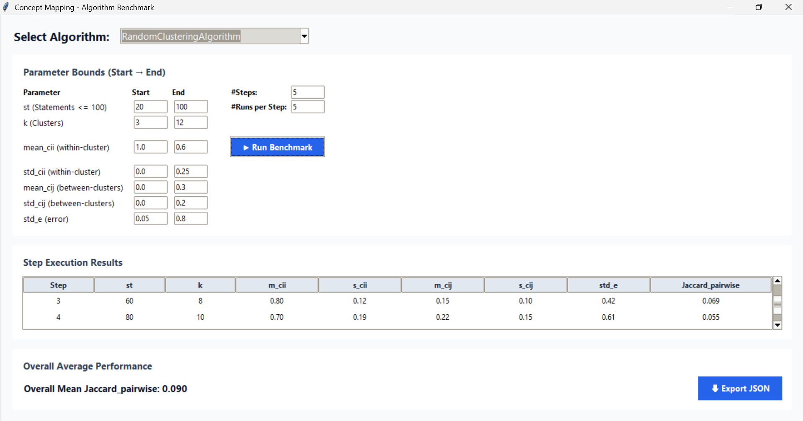
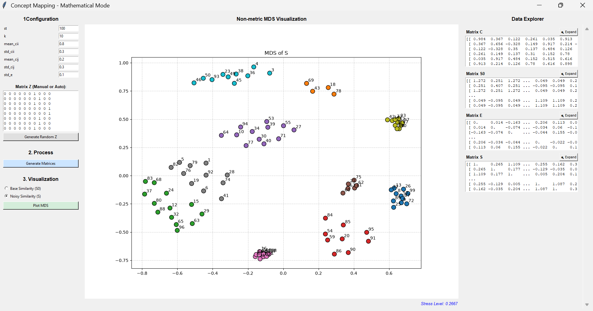

# Concept Mapping Benchmark Framework

This repository implements a synthetic benchmark for concept mapping clustering algorithms. The framework creates a known reference model, generates noisy similarity matrices from it, runs candidate algorithms, and evaluates how well each algorithm reconstructs the original statement-to-cluster structure.

## Repository Structure

- `main.py`: command-line entry point for the GUI modes.
- `gui/app.py`: Tkinter interfaces for benchmark execution and mathematical inspection.
- `src/generator.py`: synthetic generation of `Z`, `C`, `S0`, `E`, and `S`.
- `src/generation_benchmark.py`: interpolation of easy-to-hard benchmark parameter steps.
- `src/algorithms.py`: base class and implemented algorithms.
- `src/evaluation.py`: label alignment, accuracy, and Jaccard metrics.
- `experiment_settings.json`: default GUI parameters.
- `results/`: JSON benchmark outputs.
- `doc/doc.tex`: compact technical report.

## Mathematical Model

The generator builds a synthetic concept mapping problem from a known ground-truth assignment matrix.

1. `Z` is a binary statement-to-cluster matrix of shape `(st x k)`, where `st` is the number of statements and `k` is the number of clusters.
2. `C` is a symmetric cluster-level similarity matrix of shape `(k x k)`. Diagonal entries are sampled from `N(mean_cii, std_cii)` and off-diagonal entries from `N(mean_cij, std_cij)`.
3. `S0 = Z C Z^T` is the noise-free statement similarity matrix.
4. `E` is a symmetric noise matrix sampled from `N(0, std_e)`.
5. `S = S0 + E` is the noisy similarity matrix given to the algorithms. The diagonal of `S` is forced to `1.0`.

## Running

Use one of the two supported modes:

```bash
python main.py
python main.py --mode math
```

`python main.py` opens the benchmark interface. Select an algorithm, set parameter bounds, choose the number of steps and runs per step, and run the experiment.



`python main.py --mode math` opens the mathematical inspection tool. It lets the user define or generate `Z`, generate `C`, `S0`, `E`, and `S`, inspect the matrices, and visualize `S0` or `S` using non-metric MDS.



## Results

After a benchmark run, results are automatically saved as JSON under `results/` using:

```text
CMAP_[Algorithm]_[YYYYMMDD_ss-mm-hh].json
```

The time separator is `-` instead of `:` because Windows filenames cannot contain colons. The JSON contains the selected algorithm, save time, overall mean metrics, step averages, and raw iteration logs. The GUI export button can also save an additional JSON copy.

## Evaluation Metrics

Predicted cluster labels are first aligned with the ground truth by solving the label permutation problem with the Hungarian algorithm.

The current metrics are:

- `accuracy`: fraction of statements assigned to the correct aligned cluster.
- `jaccard_eqcluster`: macro Jaccard coefficient, computed as the mean Jaccard index over clusters, giving each cluster equal weight.
- `jaccard_eqst`: micro Jaccard coefficient, computed globally over pooled statement decisions, giving statements equal contribution.

For each benchmark step, the framework averages metrics over repeated runs. Overall means are then computed across all raw runs.

## Implementing New Algorithms

Add new algorithms in `src/algorithms.py` by creating a class that inherits from `BaseCMAlgorithm` and implements `fit(self, S, k)`.

```python
from src.algorithms import BaseCMAlgorithm
import numpy as np

class MyNovelAlgorithm(BaseCMAlgorithm):
    def fit(self, S: np.ndarray, k: int) -> np.ndarray:
        st = S.shape[0]

        # Insert custom clustering logic here.

        Z_alg = np.zeros((st, k), dtype=int)
        # Populate Z_alg with 1s based on your clustering results.
        return Z_alg
```

Inputs:

- `S`: the `(st x st)` noisy similarity matrix.
- `k`: the expected number of clusters.

Output:

- `Z_alg`: a binary prediction matrix of shape `(st x k)`.

The GUI discovers valid subclasses automatically, so new algorithms appear in the dropdown without modifying the GUI.

## Current Algorithms

- `RandomClusteringAlgorithm`: random baseline used to test the framework.
- `TrochimMethodAlgorithm`: traditional concept mapping pipeline using dissimilarity conversion, non-metric MDS, and Ward hierarchical clustering.
- `PeladeauMethodAlgorithm`: hierarchical clustering directly on the original dissimilarity matrix using weighted linkage.
